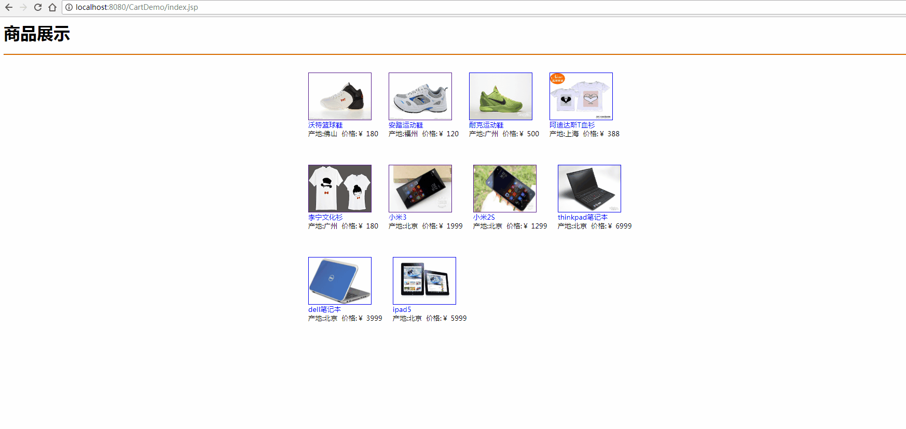

# java-Servlet
java Servlet购物车小项目，有商品列表和商品详情、购物车及浏览商品记录

## 注意事项
如果数据显示不出来的话，又没有报错的，那么问题就出现在连接数据库中了，在DBhelp.java中查看是否写错了账号和密码 再检查连接mysql驱动是否存在，在WEB-INF/lib中查看

<h1 align="center" style="margin-bottom: 20px;">雷小天博客</h1>

<code>版本号:1.0</code>

## 相关截图

